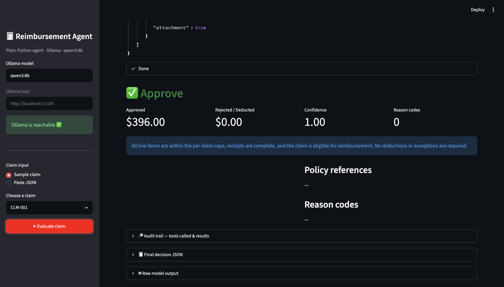
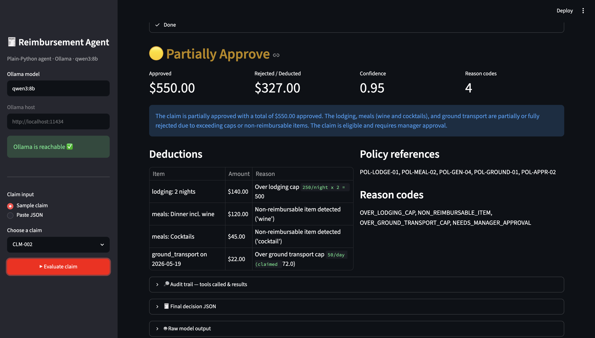
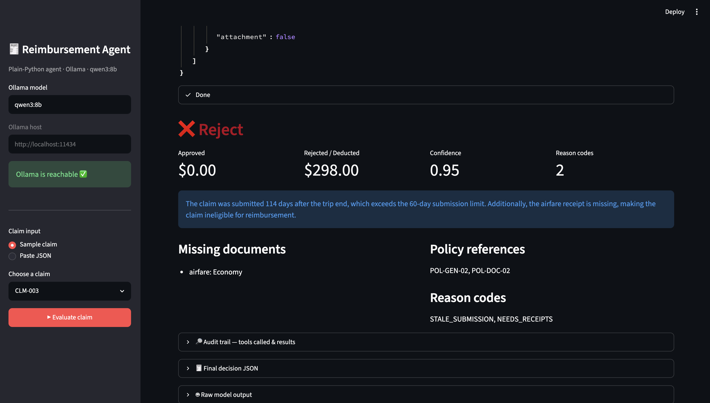
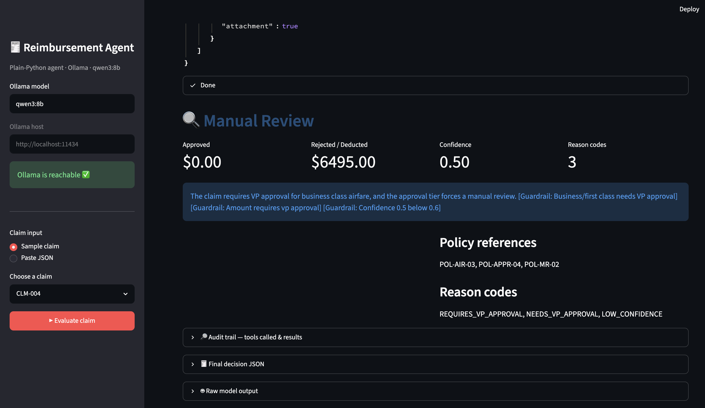
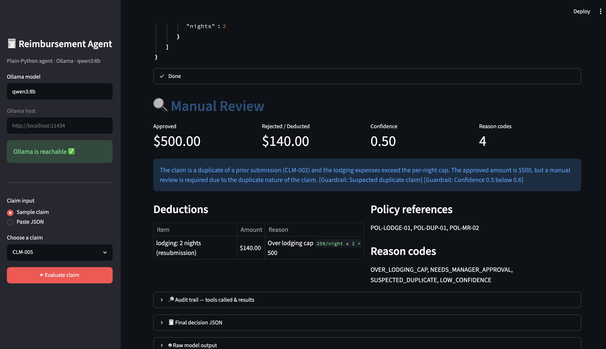

# Demo Screenshots

Screenshots of the running Streamlit UI (`streamlit run app.py`), one per sample
claim — covering all four decision types.

| File | Claim | Decision |
|------|-------|----------|
| `01-approve.png` | CLM-001 | ✅ Approve — within all per-diem caps, receipts complete |
| `02-partial-approve.png` | CLM-002 | 🟡 Partially Approve — lodging cap, alcohol, and ground-transport deductions |
| `03-reject.png` | CLM-003 | ❌ Reject — stale submission (114 days) + missing airfare receipt |
| `04-manual-review-vp-approval.png` | CLM-004 | 🔍 Manual Review — business class needs VP approval |
| `05-manual-review-duplicate.png` | CLM-005 | 🔍 Manual Review — suspected duplicate of a prior claim |

## Approve

## Partially Approve

## Reject

## Manual Review — VP approval required

## Manual Review — suspected duplicate

